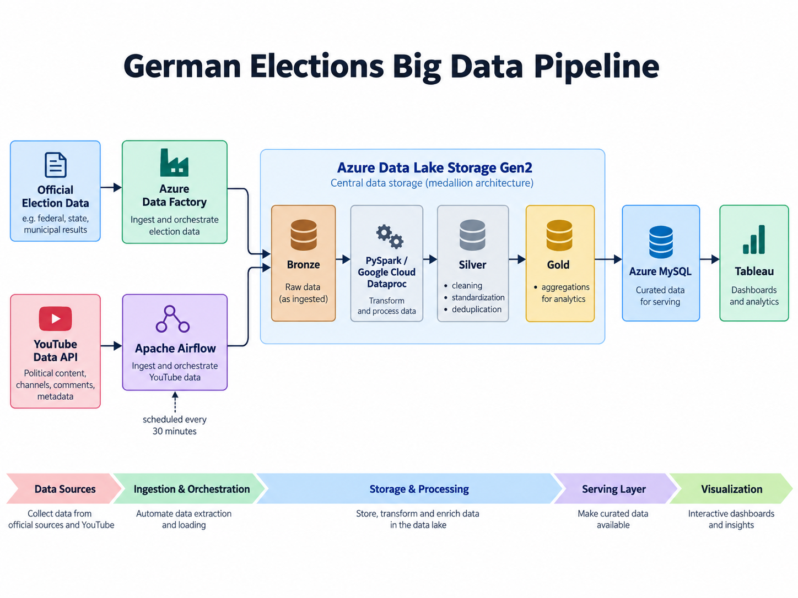
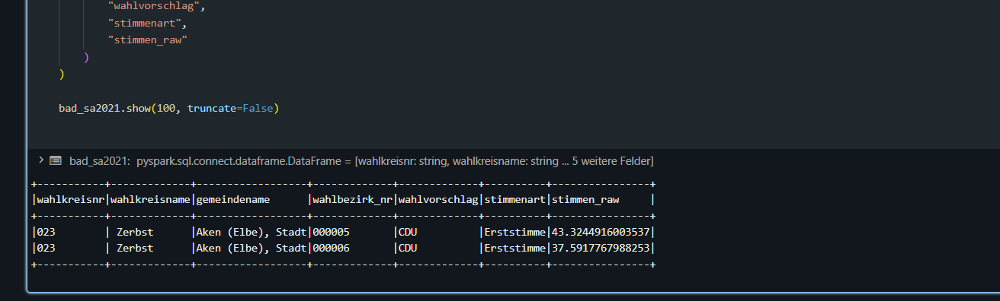
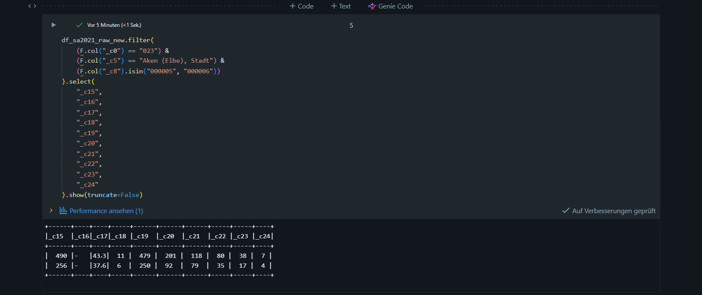

# German Elections Big Data Pipeline

End-to-End Data-Engineering-Projekt für deutsche Wahldaten und politische Aktivitätsdaten.

## Ziel

Dieses Projekt ist ein nicht-kommerzielles Bildungs- und Portfolio-Projekt.

Ziel ist der Aufbau einer vollständigen Data-Engineering-Pipeline, die offizielle deutsche Wahldaten mit öffentlichen politischen Aktivitätsdaten kombiniert und für Analyse und Reporting aufbereitet.

## Technologien

- Azure Data Factory
- Azure Data Lake Storage Gen2
- Apache Spark / PySpark
- Google Cloud Dataproc / Azure Databricks 
- Apache Airflow
- SQL / Azure MySQL
- Tableau
- 
## Datenquellen

Das Projekt verwendet mehrere Datenquellen:

- offizielle deutsche Wahldaten
- Bundestagsdaten und politische Aktivitätsdaten
- YouTube Data API

Die Daten werden über unterschiedliche Ingestion-Prozesse aufgenommen und anschließend über eine Bronze-, Silver- und Gold-Architektur verarbeitet.

## YouTube API

Die YouTube Data API wird verwendet, um öffentlich verfügbare Videos zu politischen und wahlbezogenen Themen abzurufen.

Die Pipeline sammelt unter anderem:

- Video-ID
- Titel
- Kanal-ID
- Kanalname
- Veröffentlichungszeitpunkt
- Aufrufzahlen
- Like-Zahlen
- Kommentarzahlen

Die YouTube-Daten werden regelmäßig über Apache Airflow abgerufen und zunächst im Bronze Layer von Azure Data Lake Storage gespeichert.

Anschließend startet Airflow einen PySpark-Job auf Google Cloud Dataproc.

Der Spark-Job übernimmt:

- Lesen der Bronze-Daten
- Schema-Standardisierung
- Datentyp-Konvertierung
- Data-Quality-Prüfungen
- Deduplizierung
- Aufbau des Silver Layers
- Aggregationen für den Gold Layer
- Laden ausgewählter Gold-Daten nach Azure MySQL

## Medallion Architecture

### Bronze Layer

Im Bronze Layer werden Rohdaten möglichst unverändert gespeichert.

Beispiele:

- Rohdaten aus offiziellen Wahldateien
- rohe JSON-Antworten der YouTube API

### Silver Layer

Im Silver Layer werden die Daten bereinigt und standardisiert.

Dazu gehören unter anderem:

- Datentyp-Konvertierung
- Behandlung von NULL-Werten
- Deduplizierung
- Wide-to-Long-Transformationen
- Vereinheitlichung unterschiedlicher Wahldaten-Schemata

### Gold Layer

Im Gold Layer werden analysefertige Tabellen und Aggregationen erzeugt.

Beispiele:

- Wahlergebnisse nach Partei und Region
- Wahlbeteiligung
- politische Aktivität über die Zeit
- YouTube-Kanal-Aggregationen
- Views, Likes und Kommentare nach Kanal

## Orchestrierung mit Apache Airflow

Apache Airflow steuert die automatisierte YouTube-Pipeline.

Der DAG führt regelmäßig folgende Schritte aus:

1. Abruf neuer YouTube-Daten
2. Speicherung der Rohdaten in ADLS Bronze
3. Übergabe des Bronze-Pfads über Airflow XCom
4. Start eines PySpark-Jobs auf Google Cloud Dataproc
5. Verarbeitung von Bronze zu Silver und Gold
6. Laden der Gold-Daten nach Azure MySQL

Die Pipeline ist aktuell auf einen 30-Minuten-Zeitplan ausgelegt.

## Architektur

## Ergebnis

Ausgewählte Gold-Daten werden in Azure MySQL geladen und anschließend in Tableau visualisiert.

Das Dashboard zeigt unter anderem:

- Wahlergebnisse nach Partei und Region
- Wahlbeteiligung
- politische Aktivität über die Zeit
- YouTube-Aktivität nach Kanal
- Views, Likes und Kommentare

## Wichtige Engineering-Herausforderungen

Während des Projekts wurden unter anderem folgende Herausforderungen behandelt:

- unterschiedliche Schemas deutscher Wahldaten
- CSV-Dateien mit unterschiedlichen Header-Positionen
- YouTube-API-Pagination
- API-Quota-Limits
- inkrementelle Datenaufnahme
- Deduplizierung nach (video_id)
- OAuth-Zugriff von Dataproc auf Azure Data Lake Storage
- Cross-Cloud-Kommunikation zwischen GCP und Azure
- Cloud NAT und MySQL-Firewall-Regeln
- Spark-Performance und Vermeidung unnötiger Actions
- Bei einer Wahldatenquelle trat nach der Konvertierung von Excel nach CSV eine
  Spaltenverschiebung auf. Dadurch wurden einzelne Werte nicht mehr den ursprünglich
  vorgesehenen Spalten zugeordnet.
  

  Das Problem wurde durch gezielte Plausibilitätsprüfungen auf Ebene einzelner
  Wahlkreise und Wahlbezirke erkannt. Anschließend wurden die betroffenen Spalten
  analysiert und die relevanten Werte wieder einem standardisierten Schema
  zugeordnet.
  
  
## Designentscheidungen

Im Verlauf des Projekts wurde die Architektur mehrfach angepasst, um eine stabile und nachvollziehbare Verarbeitung der Daten zu gewährleisten.

Zu Beginn wurde Azure Databricks über einen Connector mit Azure Data Lake Storage verbunden und für die ersten PySpark-Transformationen verwendet.

Da die verfügbare Databricks-Umgebung später Einschränkungen bei Compute und Kosten hatte, wurde die Spark-Verarbeitung auf Google Cloud Dataproc verlagert.

Dabei blieb Azure Data Lake Storage weiterhin der zentrale Data Lake für Bronze-, Silver- und Gold-Daten. Dataproc wurde ausschließlich als Spark-Compute eingesetzt.

Die grundlegende Architektur blieb dadurch erhalten:

- Azure Data Lake Storage als zentrale Datenablage
- PySpark für Transformation und Aggregation
- Google Cloud Dataproc als Compute-Umgebung
- Azure MySQL als Serving Layer
- Tableau für Analyse und Visualisierung

Für den aktuellen Portfolio-Datenumfang werden einzelne Silver- und Gold-Datasets bei der Verarbeitung vollständig neu geschrieben. Diese Lösung wurde bewusst gewählt, da sie für den vorhandenen Datenumfang einfach, transparent und ausreichend stabil ist.

## Tableau Dashboard

Die aufbereiteten Daten werden in Tableau Public visualisiert.
 [Interaktive Tableau-Galerie öffnen](https://public.tableau.com/app/profile/majd.mustafa/vizzes)
